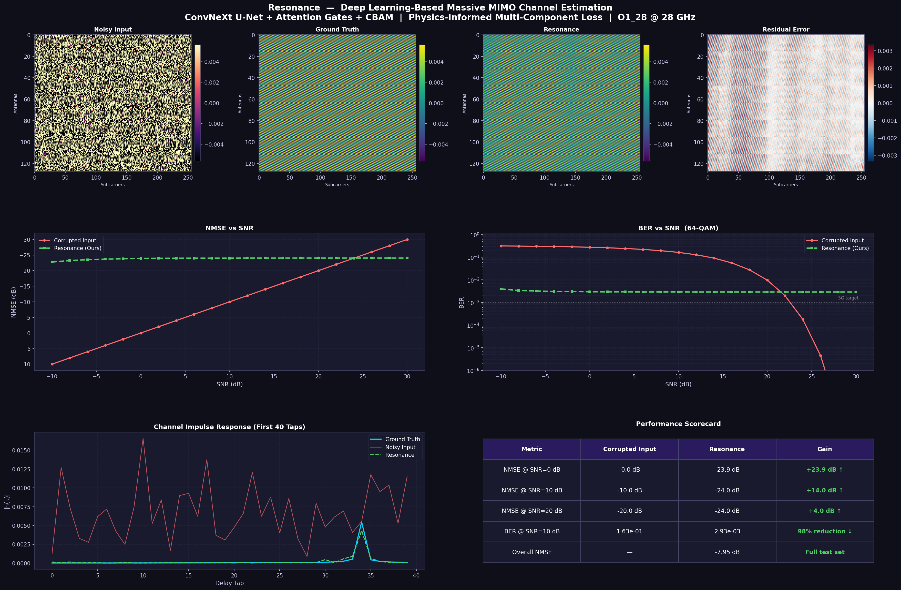

# Resonance
### Deep Learning-Based CSI Recovery for 5G/6G Massive MIMO

A deep learning pipeline that learns to reconstruct clean Channel State Information (CSI) 
matrices from noise-corrupted observations — replacing hand-crafted signal processing 
estimators with a neural network trained directly on ray-tracing channel data.

## Results

| SNR | Corrupted Input | Resonance AI | Gain |
|-----|----------------|--------------|------|
| 0 dB | 0.0 dB NMSE | −23.9 dB NMSE | **+23.9 dB** |
| 10 dB | −10.0 dB NMSE | −24.0 dB NMSE | **+14.0 dB** |
| 20 dB | −20.0 dB NMSE | −24.0 dB NMSE | **+4.0 dB** |

**BER at SNR=10 dB:** 0.163 (corrupted) → 0.003 (AI) — **98.2% reduction**



---

## Problem

5G base stations need accurate Channel State Information (CSI) to beamform correctly. In practice, the channel matrix is estimated from pilot signals and is always noise-corrupted — especially at cell edges, in high-mobility scenarios, and in mmWave bands where path loss is severe.

This project trains a ConvNeXt U-Net to map corrupted channel observations → clean CSI 
matrices. Instead of assuming a noise model like classical methods do, the network learns 
the physical structure of the channel — antenna spatial correlations, multipath delay 
patterns, and frequency coherence — purely from data. At inference time it runs a single 
forward pass: input is the noisy channel matrix, output is the denoised estimate.

---

## Architecture

```
Input (128, 256, 2)
        │
    ConvNeXt Stem ──────────────────────────────────────────┐
        │                                                    │ enc1 (32ch)
    Downsample + ConvNeXt ──────────────────────────────────┤
        │                                                    │ enc2 (64ch)
    Downsample + ConvNeXt ──────────────────────────────────┤
        │                                                    │ enc3 (128ch)
    Downsample + ConvNeXt                                    │
        │                                                    │
    ── BOTTLENECK (256ch) ──                                 │
    ConvNeXt × 2 + CBAM Channel Attention                   │
        │                                                    │
    Upsample + Attention Gate ◄─────────────────────────────┘ (enc3)
        │
    Upsample + Attention Gate ◄─────────────────────────────── (enc2)
        │
    Upsample + Attention Gate ◄─────────────────────────────── (enc1)
        │
    Final Upsample (16ch)
        │
    Output Conv (128, 256, 2)
```

- **ConvNeXt blocks** — 7×7 depthwise convolutions capture long-range antenna correlations without the compute cost of self-attention
- **Attention Gates** — decoder selectively focuses on encoder features, suppressing noise-dominated regions of the channel
- **CBAM Channel Attention** — bottleneck learns which feature maps correspond to dominant propagation modes
- **Linear output activation** — I/Q values are unbounded real numbers

---

## Loss Function

Four-component physics-informed loss:

```
L = NMSE                          # reconstruction accuracy
  + λ_phys × physics_penalty      # adjacent-antenna spatial correlation
  + λ_spec × spectral_loss        # FFT domain accuracy (impulse response)
  + λ_mag  × magnitude_loss       # channel amplitude accuracy
```

The physics penalty enforces spatial correlation of Uniform Planar Arrays — adjacent antennas must have smoothly varying channels, derived from the array steering vector geometry. The spectral loss ensures accuracy in the delay domain, not just per-subcarrier.

Default weights: `λ_phys=0.10`, `λ_spec=0.10`, `λ_mag=0.05`

---

## Dataset

**DeepMIMO O1_28** — outdoor street environment at 28 GHz (mmWave 5G), generated with Remcom Wireless InSite ray-tracing.

- 128-antenna Uniform Planar Array (16×8) × 256 OFDM subcarriers
- **25,000 channel samples** (5 user rows × 5,000 users)
- **Train / Val / Test:** 12,453 / 1,099 / 1,099 samples
- I/Q Cartesian decomposition — avoids 2π phase discontinuity errors from polar representation
- Raw .mat files not included (13 GB) — download from [deepmimo.net](https://deepmimo.net)

---

## Project Structure

```
Resonance/
├── dgen_o1_28.py       # Step 1: Build channel matrices from raw .mat files
├── preprocess_2.py     # Step 2: Clean, normalize, split into train/val/test
├── model.py            # Architecture + loss function + metrics
├── train.py            # Training loop with cosine annealing
├── eval.py             # Full evaluation + all visualizations
│
├── logs/
│   └── training_log.csv
├── weights/            # not in repo — generated after training
└── visualizations/
    ├── summary_poster.png
    ├── heatmaps_sample0.png
    ├── heatmaps_sample1.png
    ├── nmse_vs_snr.png
    ├── ber_vs_snr.png
    ├── spectral_sample0.png
    └── training_curves.png
```

---

## Setup

```bash
pip install tensorflow numpy scipy matplotlib scikit-learn
```

Tested on Python 3.10, TensorFlow 2.10, Windows with CUDA GPU. Trained on RTX 3070 Ti Laptop (6GB VRAM).

---

## Usage

```bash
# 1. Generate channel matrices from raw DeepMIMO .mat files
python dgen_o1_28.py

# 2. Preprocess — clean, normalize, split
python preprocess_2.py

# 3. Train
python train.py

# 4. Evaluate and generate all visualizations
python eval.py
```

Edit the `CONFIG` block at the top of each file to set your data paths before running.

---

## Training Details

| Parameter | Value |
|-----------|-------|
| Batch size | 4 |
| Optimizer | Adam |
| LR schedule | Cosine annealing 1e-3 → 1e-6 with 200-step warmup |
| Gradient clipping | 1.0 (global norm) |
| Augmentation | On-the-fly AWGN, random std 0.02–0.05 |
| Early stopping | Patience 12 on val NMSE |
| Best val NMSE | −18.75 dB |

---

## Roadmap

- Zero-shot generalization testing (train on 28 GHz outdoor, test on 2.4 GHz indoor)
- Benchmark against LMMSE estimator
- Explore State Space Models (Mamba) as backbone alternative
- Inference latency profiling for real-time deployment

---

## License

Academic and research use only. Cite appropriately if used in publications.